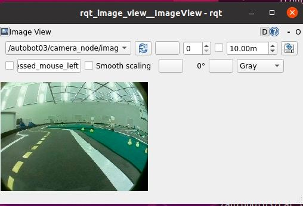

## Получение изображения с камеры

После подключения к автоботу вводим команду:

```# rqt_image_view```

В выпадающем списке в открывшемся GUI нужно выбрать топик, из которого мы будем читать изображение. В моем случае - это /autobot03/camera_node/image


